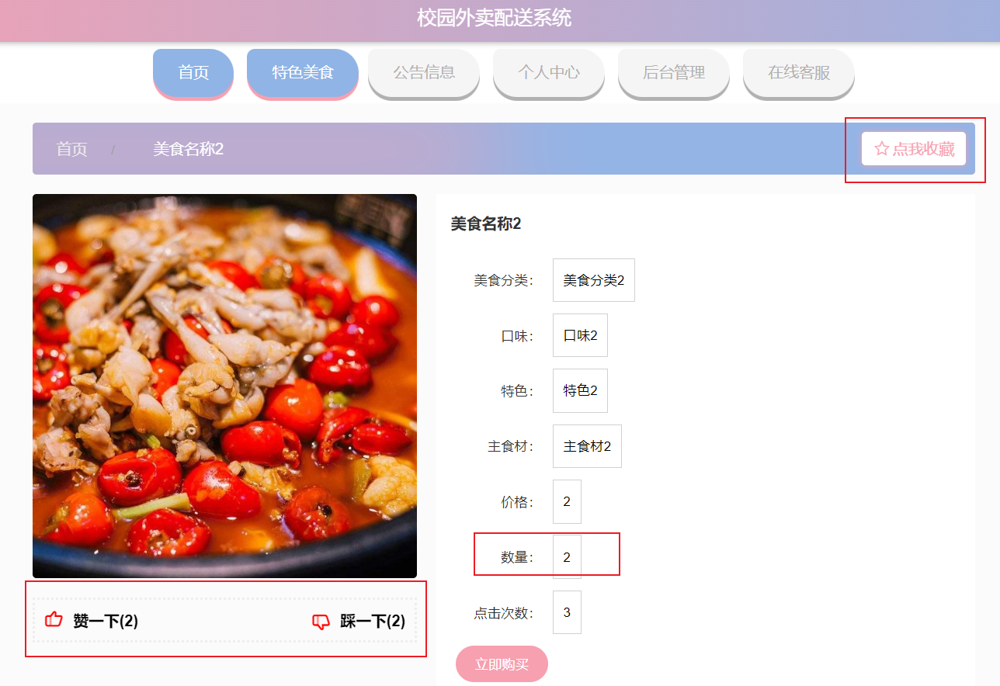
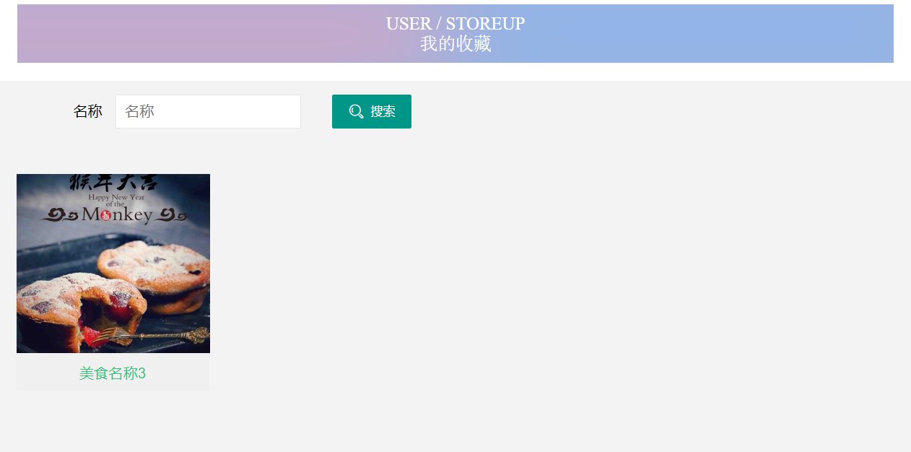
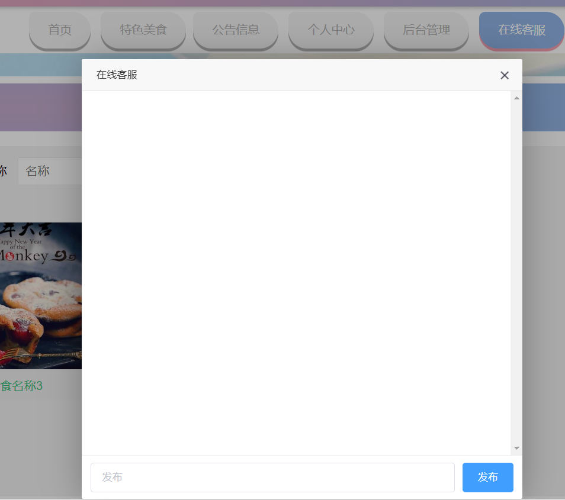
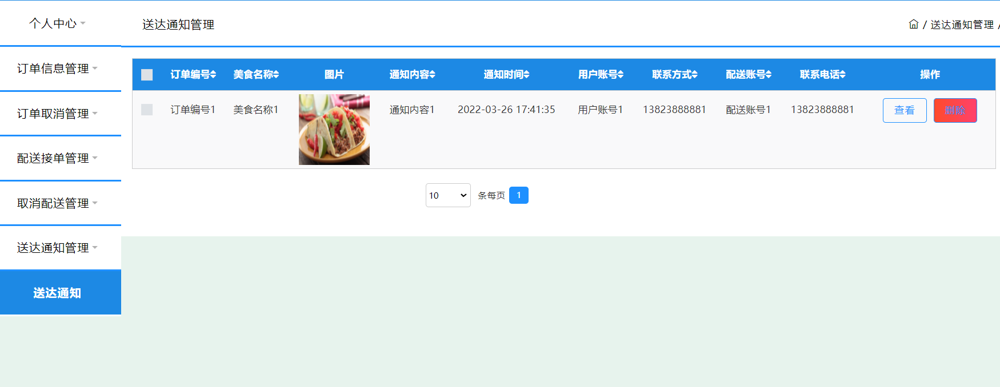
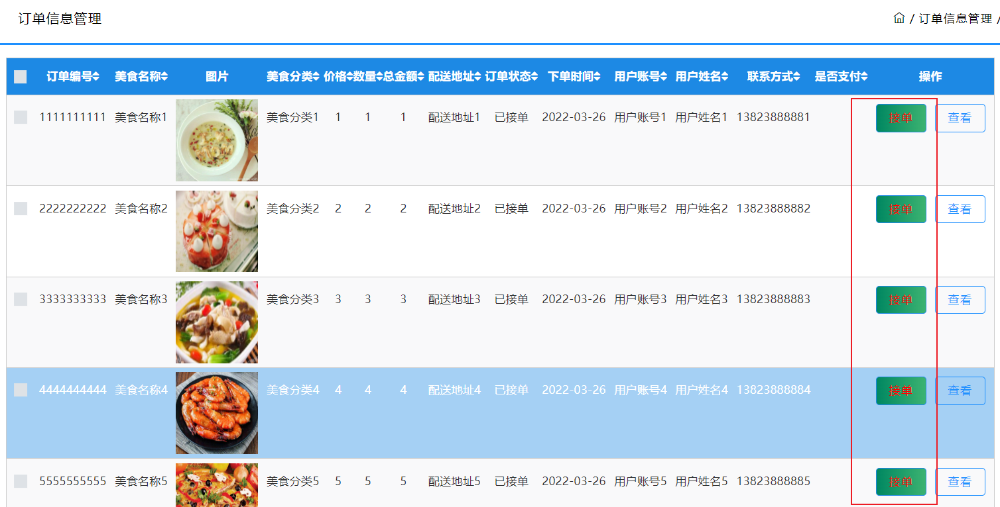
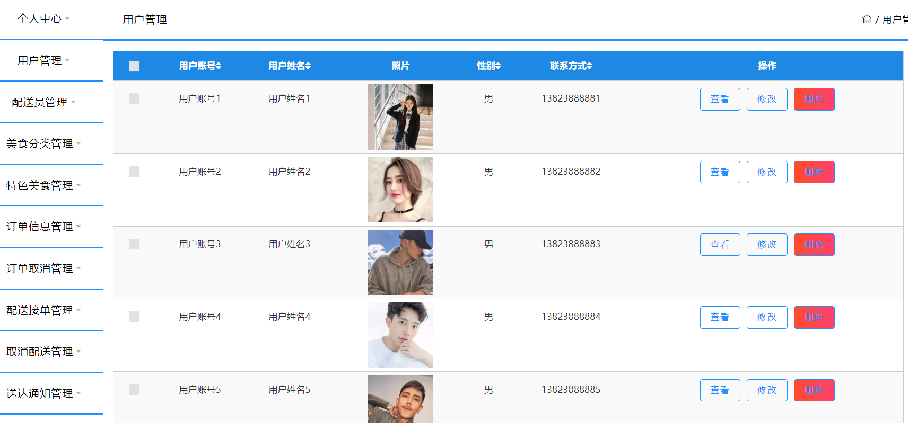
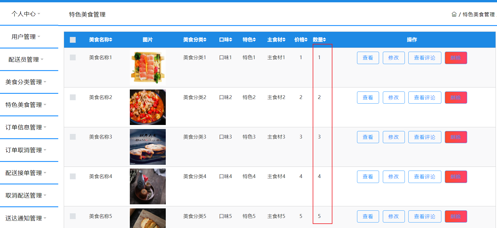
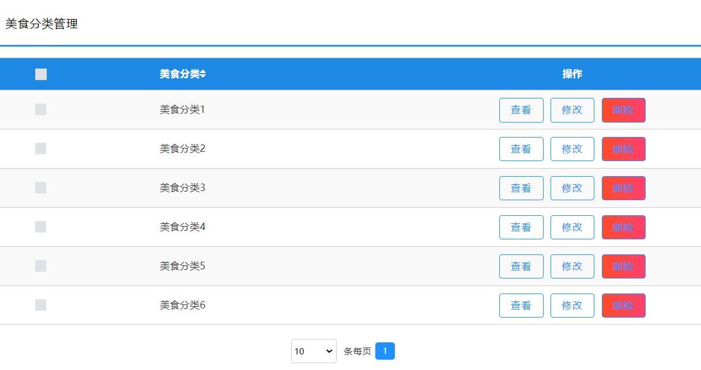
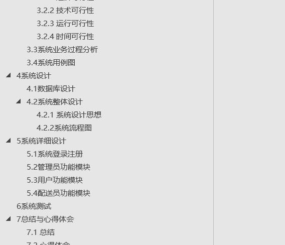
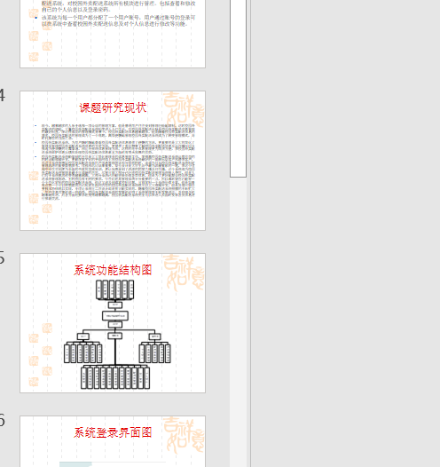

## 
>【项目特色】
>
>- **在线客服**
>- **接单**，配送员可以看到所有订单，进行接单抢单
>- **送达通知**，配送员送到之后，会向用户发送配送通知
>- **数量预警**，当库存少于指定数目会发送预警，确保及时供货
>- **QQ:3270728362**

## 简介

**基于SSM的点餐外卖配送系统**

- 开发语言：Java 
- 数据库：MySQL 
- 技术：Spring+SpringMVC+MyBatis+ElementUI 
- 工具：IDEA/Ecilpse、Navicat、Maven 

## 功能描述

**角色**：管理员、用户、配送员

- 用户的功能及权限 用户登录注册后，进入系统对个人中心，订单信息管理，订单取消管理，配送接单管理，取消配送管理，送达通知管理等功能进行操作管理。 
- 配送员的功能及权限 用户登录注册后，进入系统对个人中心，订单信息管理，配送接单管理，取消配送管理，送达通知管理等功能进行操作管理。 
- 管理员的功能及权限 用户信息的添加和管理，校园外卖配送详细信息添加和管理和文档信息添加和管理以及网站信息管理，这些都是管理员的功能。

## 系统展示

**前台**

>外卖食物详情，可以点赞以及不喜欢踩一下，并且可以收藏。

>我的收藏

>在线客服

> 用户配送通知，可以看到自己的外卖配送情况。

>配送员可以看到所有订单，进行接单抢单

> 管理员功能

##  相关文档

> 相关文档PPT也是完整的，需要的可以联系我。

